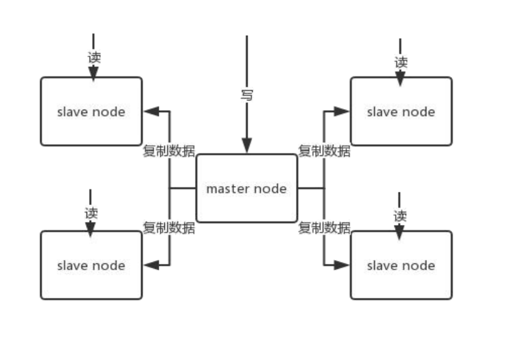
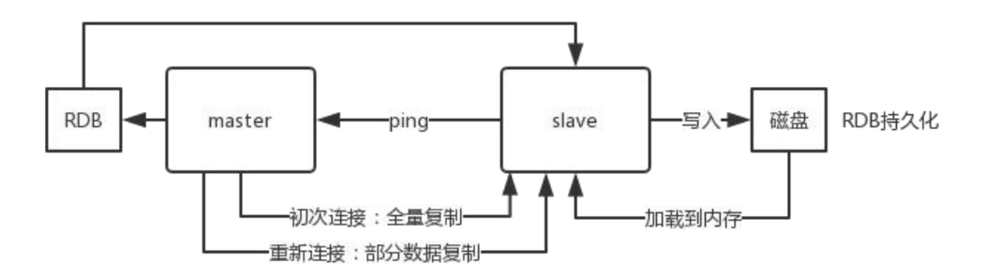
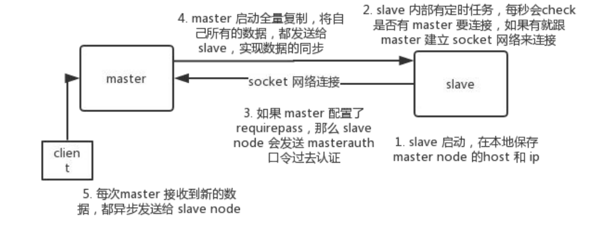
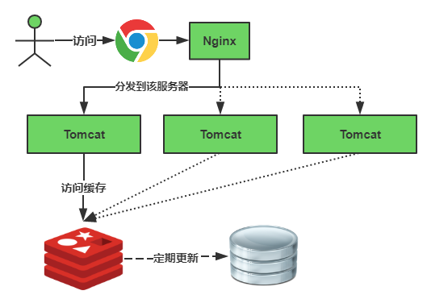
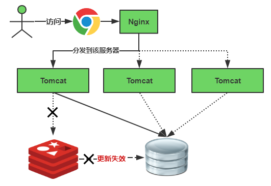
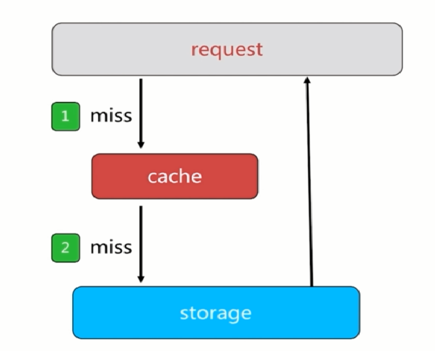
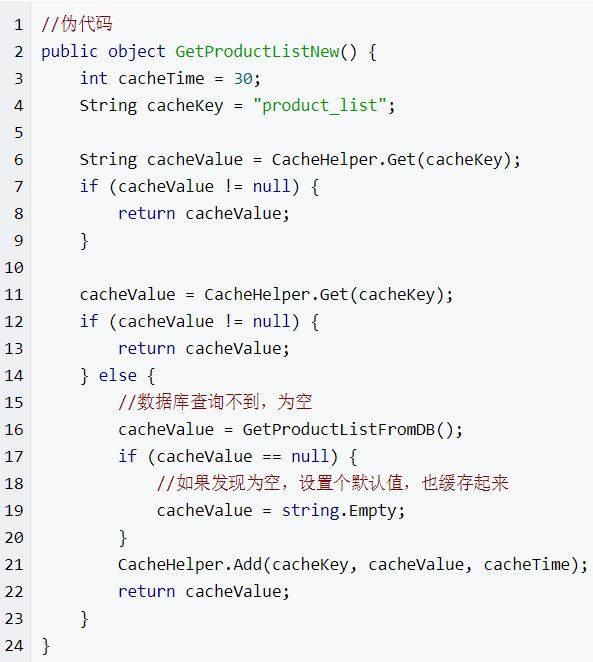
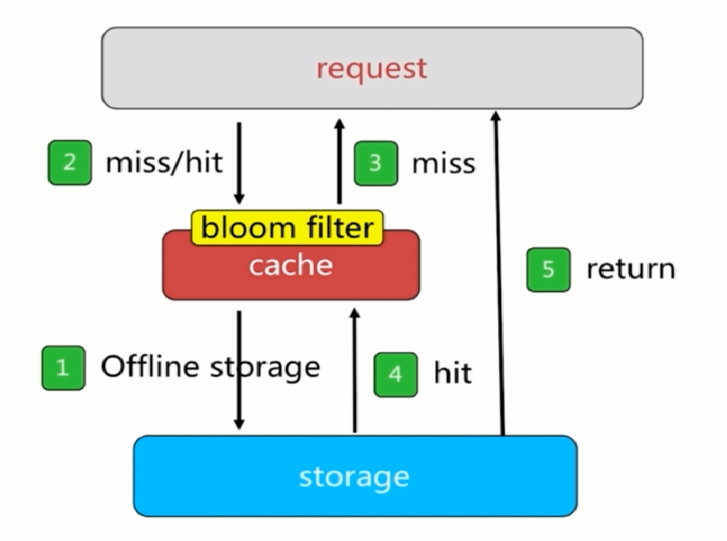
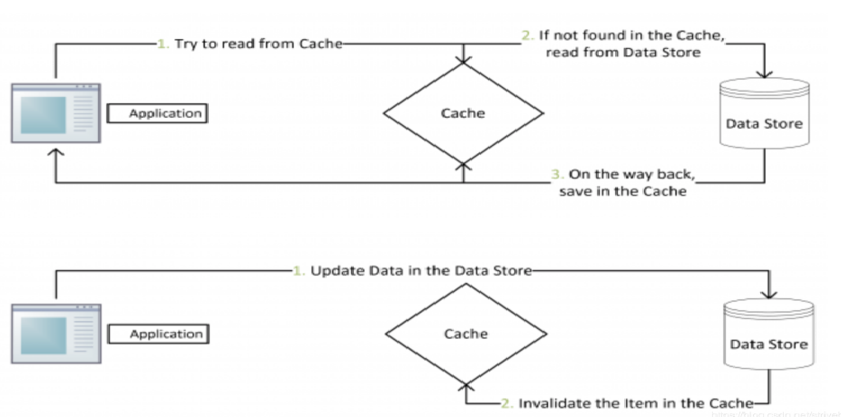

<!-- TOC -->

- [1. redis架构：高并发、高可用](#1-redis架构高并发高可用)
    - [1.1. redis为什么这么快？](#11-redis为什么这么快)
    - [1.2. 你们生产环境中Redis架构是怎么样的](#12-你们生产环境中redis架构是怎么样的)
    - [1.3. 如何保证 redis 的高并发和高可用？redis 的主从复制原理能介绍一下么？redis 的哨兵原理能介绍一 下么？](#13-如何保证-redis-的高并发和高可用redis-的主从复制原理能介绍一下么redis-的哨兵原理能介绍一-下么)
- [2. Redis 主从架构:](#2-redis-主从架构)
    - [2.1. redis replication 的核心机制](#21-redis-replication-的核心机制)
    - [2.2. redis 主从复制的核心原理](#22-redis-主从复制的核心原理)
    - [2.3. 主从复制的断点续传](#23-主从复制的断点续传)
    - [2.4. 无磁盘化复制](#24-无磁盘化复制)
    - [2.5. 过期 key 处理](#25-过期-key-处理)
    - [2.6. 复制的完整流程](#26-复制的完整流程)
    - [2.7. 全量复制](#27-全量复制)
    - [2.8. 增量复制](#28-增量复制)
    - [2.9. heartbeat](#29-heartbeat)
    - [2.10. 异步复制](#210-异步复制)
    - [2.11. redis 如何才能做到高可用](#211-redis-如何才能做到高可用)
    - [2.12. 哨兵的介绍](#212-哨兵的介绍)
- [3. redis集群架构](#3-redis集群架构)
- [4. redis: 雪崩、穿透、预热等](#4-redis-雪崩穿透预热等)
    - [4.1. 缓存雪崩](#41-缓存雪崩)
    - [4.2. 缓存穿透](#42-缓存穿透)
    - [4.3. 缓存击穿](#43-缓存击穿)
    - [4.4. 缓存预热](#44-缓存预热)
    - [4.5. 缓存和数据库一致性](#45-缓存和数据库一致性)
        - [4.5.1. 产生原因](#451-产生原因)
        - [4.5.2. 更新缓存](#452-更新缓存)
            - [4.5.2.1. Cache Aside Pattern(旁路缓存)](#4521-cache-aside-pattern旁路缓存)
            - [4.5.2.2. Read/Write Through Pattern](#4522-readwrite-through-pattern)
            - [4.5.2.3. Write Behind Caching Pattern](#4523-write-behind-caching-pattern)
        - [4.5.3. 缓存和DB一致性的解决方案](#453-缓存和db一致性的解决方案)
            - [4.5.3.1. 先淘汰缓存，再写数据库](#4531-先淘汰缓存再写数据库)
            - [4.5.3.2. 先写数据库，再更新缓存](#4532-先写数据库再更新缓存)
- [5. redis面试题：21问](#5-redis面试题21问)
    - [5.1. 什么是redis?](#51-什么是redis)
    - [5.2. Reids的特点](#52-reids的特点)
    - [5.3. 使用redis有哪些好处？](#53-使用redis有哪些好处)
    - [5.4. redis相比memcached有哪些优势？](#54-redis相比memcached有哪些优势)
    - [5.5. Memcache与Redis的区别都有哪些？](#55-memcache与redis的区别都有哪些)
    - [5.6. redis适用于的场景?](#56-redis适用于的场景)
    - [5.7. redis的缓存失效策略和主键失效机制](#57-redis的缓存失效策略和主键失效机制)
    - [5.8. 为什么redis需要把所有数据放到内存中?](#58-为什么redis需要把所有数据放到内存中)
    - [5.9. Redis是单进程单线程的](#59-redis是单进程单线程的)
    - [5.10. redis的并发竞争问题如何解决?](#510-redis的并发竞争问题如何解决)
    - [5.11. redis常见性能问题和解决方案：](#511-redis常见性能问题和解决方案)
    - [5.12. redis事物的了解CAS(check-and-set 操作实现乐观锁 )?](#512-redis事物的了解cascheck-and-set-操作实现乐观锁-)
    - [5.13. WATCH命令和基于CAS的乐观锁?](#513-watch命令和基于cas的乐观锁)
    - [5.14. 使用过Redis分布式锁么，它是什么回事？](#514-使用过redis分布式锁么它是什么回事)
    - [5.15. 假如Redis里面有1亿个key，其中有10w个key是以某个固定的已知的前缀开头的，如果将它们全部找出来？](#515-假如redis里面有1亿个key其中有10w个key是以某个固定的已知的前缀开头的如果将它们全部找出来)
    - [5.16. 使用过Redis做异步队列么，你是怎么用的？](#516-使用过redis做异步队列么你是怎么用的)
    - [5.17. 如果有大量的key需要设置同一时间过期，一般需要注意什么？](#517-如果有大量的key需要设置同一时间过期一般需要注意什么)
    - [5.18. Redis如何做持久化的？](#518-redis如何做持久化的)
    - [5.19. Pipeline有什么好处，为什么要用pipeline？](#519-pipeline有什么好处为什么要用pipeline)
    - [5.20. Redis的同步机制了解么？](#520-redis的同步机制了解么)
    - [5.21. 是否使用过Redis集群，集群的原理是什么？](#521-是否使用过redis集群集群的原理是什么)

<!-- /TOC -->


# 1. redis架构：高并发、高可用
<a id="markdown-redis架构高并发高可用" name="redis架构高并发高可用"></a>

## 1.1. redis为什么这么快？
<a id="markdown-redis为什么这么快" name="redis为什么这么快"></a>
* 完全基于内存，绝大部分请求是纯粹的内存操作，非常快速。数据存在内存中，类似于HashMap，HashMap的优势就是查找和操作的时间复杂度都是O(1)；

* 数据结构简单，对数据操作也简单，Redis中的数据结构是专门进行设计的；

* 采用单线程，避免了不必要的上下文切换和竞争条件，也不存在多进程或者多线程导致的切换而消耗 CPU，不用去考虑各种锁的问题，不存在加锁释放锁操作，没有因为可能出现死锁而导致的性能消耗；

* 使用多路I/O复用模型，非阻塞IO；

* 使用底层模型不同，它们之间底层实现方式以及与客户端之间通信的应用协议不一样，Redis直接自己构建了VM 机制 ，因为一般的系统调用系统函数的话，会浪费一定的时间去移动和请求；
    > **多路 I/O 复用模型:**
    多路I/O复用模型是利用 select、poll、epoll 可以同时监察多个流的 I/O 事件的能力，在空闲的时候，会把当前线程阻塞掉，当有一个或多个流有 I/O 事件时，就从阻塞态中唤醒，于是程序就会轮询一遍所有的流（epoll 是只轮询那些真正发出了事件的流），并且只依次顺序的处理就绪的流，这种做法就避免了大量的无用操作。

## 1.2. 你们生产环境中Redis架构是怎么样的
<a id="markdown-你们生产环境中redis架构是怎么样的" name="你们生产环境中redis架构是怎么样的"></a>
1. 面试官心里分析

    看看你了解不了解你们公司的redis生产集群的部署架构，如果你不了解，那么确实你就很失职 了，你的redis是主从架构？集群架构？用了哪种集群方案？有没有做高可用保证？有没有开启  持久化机制确保可以进行数据恢复？线上redis给几个G的内存？设置了哪些参数？压测后你们    redis集群承载多少QPS？

2. 面试题剖析

    redis cluster，10台机器，5台机器部署了redis主实例，另外5台机器部署了redis的从实例，每个主实例挂了一个从实例，5个节点对外提供读写服务，每个节点的读写高峰qps可能可以达到每秒5万，5台机器最多是25万读写请求/s。

    机器是什么配置？32G内存+8核CPU+1T磁盘，但是分配给redis进程的是10g内存，一般线上生产环境，redis的内存尽量不要超过10g，超过10g可能会有问题。

    5台机器对外提供读写，一共有50g内存。

    因为每个主实例都挂了一个从实例，所以是高可用的，任何一个主实例宕机，都会自动故障迁移，redis从实例会自动变成主实例继续提供读写服务

    你往内存里写的是什么数据？每条数据的大小是多少？商品数据，每条数据是10kb。100条数据是1mb，10万条数据是1g。常驻内存的是200万条商品数据，占用内存是20g，仅仅不到总内存的50%。

    目前高峰期每秒就是3500左右的请求量

## 1.3. 如何保证 redis 的高并发和高可用？redis 的主从复制原理能介绍一下么？redis 的哨兵原理能介绍一 下么？
<a id="markdown-如何保证-redis-的高并发和高可用redis-的主从复制原理能介绍一下么redis-的哨兵原理能介绍一-下么" name="如何保证-redis-的高并发和高可用redis-的主从复制原理能介绍一下么redis-的哨兵原理能介绍一-下么"></a>
```
面试官心理分析:
其实问这个问题，主要是考考你，redis 单机能承载多高并发？如果单机扛不住如何扩容扛更多的并发？

redis 会不会挂？既然 redis 会挂那怎么保证 redis 是高可用的？

其实针对的都是项目中你肯定要考虑的一些问题，如果你没考虑过，那确实你对生产系统中的问题思考太少

```

***

# 2. Redis 主从架构:
<a id="markdown-redis-主从架构" name="redis-主从架构"></a>
单机的 redis，能够承载的 QPS 大概就在上万到几万不等。对于缓存来说，一般都是用来支撑读高并发的。

因此架构做成主从(master-slave)架构，一主多从，主负责写，并且将数据复制到其它的 slave 节点，从节点负责读。所有的读请求全部走从节点。这样也可以很轻松实现水平扩容，支撑读高并发。

***

## 2.1. redis replication 的核心机制
<a id="markdown-redis-replication-的核心机制" name="redis-replication-的核心机制"></a>

* redis 采用异步方式复制数据到 slave 节点，不过 redis2.8 开始，slave node 会周期性地确认自己每次复制的数据量；

* 一个 master node 是可以配置多个 slave node 的；

* slave node 也可以连接其他的 slave node；

* slave node 在做复制的时候，也不会**阻塞**对自己的查询操作，它会用旧的数据集来提供服务,但是复制完成的时候，需要删除旧数据集，加载新数据集，这个时候就会暂停对外服务了；

* slave node 主要用来进行横向扩容，做读写分离，扩容的 slave node 可以提高读的吞吐量。

* 如果采用了主从架构，那么建议必须开启 master node 的持久化，不建议用 slave node 作为master node 的数据热备，因为那样的话，如果你关掉 master 的持久化，可能在 master 宕机重启的时候数据是空的，然后可能一经过复制， slave node 的数据也丢了。

* 另外，master 的各种备份方案，也需要做。万一本地的所有文件丢失了，从备份中挑选一份 rdb 去恢复master，这样才能确保启动的时候，是有数据的，即使采用了后续讲解的高可用机制，slave node 可以自动接管 master node，但也可能 sentinel 还没检测到 master failure，master node 就自动重启了，还是可能导致上面所有的 slave node 数据被清空。

***

## 2.2. redis 主从复制的核心原理
<a id="markdown-redis-主从复制的核心原理" name="redis-主从复制的核心原理"></a>
当启动一个 slave node 的时候，它会发送一个 PSYNC 命令给 master node。
如果这是 slave node 初次连接到 master node，那么会触发一次 full resynchronization 全量复制。
此时 master 会启动一个后台线程，开始生成一份 RDB 快照文件，同时还会将从客户端 client 新收到的所有写命令缓存在内存中。RDB 文件生成完毕后， master 会将这个 RDB 发送给 slave，slave 会先写入本地磁盘，然后再从本地磁盘加载到内存中，接着 master 会将内存中缓存的写命令发送到 slave，slave 也会同步这些数据。slave node 如果跟 master node 有网络故障，断开了连接，会自动重连，连接之后 master node 仅会复制给 slave 部分缺少的数据。


)

***

## 2.3. 主从复制的断点续传
<a id="markdown-主从复制的断点续传" name="主从复制的断点续传"></a>
从 redis2.8 开始，就支持主从复制的断点续传，如果主从复制过程中，网络连接断掉了，那么可以接着上次复制的地方，继续复制下去，而不是从头开始复制一份。

master node 会在内存中维护一个 backlog，master 和 slave 都会保存一个 replica offset 还有一个master run id，offset 就是保存在 backlog 中的。如果 master 和 slave 网络连接断掉了，slave 会让 master 从上次 replica offset 开始继续复制，如果没有找到对应的 offset，那么就会执行一次 resynchronization。

如果根据 host+ip 定位 master node，是不靠谱的，如果 master node 重启或者数据出现了变化，那么 slave node 应该根据不同的 run id 区分。
***

## 2.4. 无磁盘化复制
<a id="markdown-无磁盘化复制" name="无磁盘化复制"></a>
master 在内存中直接创建 RDB，然后发送给 slave，不会在自己本地落地磁盘了。只需要在**配置文件**中开启 repl-diskless-sync yes 即可。
```
repl-diskless-sync yes
# 等待 5s 后再开始复制，因为要等更多 slave 重新连接过来
repl-diskless-sync-delay 5
```

***

## 2.5. 过期 key 处理
<a id="markdown-过期-key-处理" name="过期-key-处理"></a>
slave 不会过期 key，只会等待 master 过期 key。如果 master 过期了一个 key，或者通过 LRU 淘汰了一个 key，那么会模拟一条 del 命令发送给 slave。
***

## 2.6. 复制的完整流程
<a id="markdown-复制的完整流程" name="复制的完整流程"></a>
slave node 启动时，会在自己本地保存 master node 的信息，包括 master node 的 host 和 ip，但是复制流程没开始。

slave node 内部有个定时任务，每秒检查是否有新的 master node 要连接和复制，如果发现，就跟 master node 建立 socket 网络连接。然后 slave node 发送 ping 命令给 master node。如果 master 设置了requirepass，那么 slave node 必须发送 masterauth 的口令过去进行认证。master node 第一次执行全量复制，将所有数据发给 slave node。而在后续，master node 持续将写命令，异步复制给 slave node。


***

## 2.7. 全量复制
<a id="markdown-全量复制" name="全量复制"></a>
* master 执行 bgsave ，在本地生成一份 rdb 快照文件。

* master node 将 rdb 快照文件发送给 slave node，如果 rdb 复制时间超过 60 秒（repl-timeout），那么 slave node 就会认为复制失败，可以适当调大这个参数(对于千兆网卡的机器，一般每秒传输 100MB，6G 文件，很可能超过 60s)

* master node 在生成 rdb 时，会将所有新的写命令缓存在内存中，在 slave node 保存了 rdb 之后，再将新的写命令复制给 slave node。

* 如果在复制期间，内存缓冲区持续消耗超过 64MB，或者一次性超过 256MB，那么停止复制，复制失败。

    ```
    client-output-buffer-limit slave 256MB 64MB 60
    ```
* slave node 接收到 rdb 之后，清空自己的旧数据，然后重新加载 rdb 到自己的内存中，同时基于旧的数据版本对外提供服务。

* 如果 slave node 开启了 AOF，那么会立即执行 BGREWRITEAOF，重写 AOF。

***

## 2.8. 增量复制
<a id="markdown-增量复制" name="增量复制"></a>
* 如果全量复制过程中，master-slave 网络连接断掉，那么 slave 重新连接 master 时，会触发增量复制。

* master 直接从自己的 backlog 中获取部分丢失的数据，发送给 slave node，默认 backlog 就是1MB。
    ```
    rel_backlog_size
    ```

* master 就是根据 slave 发送的 psync 中的 offset 来从 backlog 中获取数据的。

***

## 2.9. heartbeat
<a id="markdown-heartbeat" name="heartbeat"></a>
主从节点互相都会发送 heartbeat 信息。

master 默认每隔 10 秒 发送一次 heartbeat，slave node 每隔 1 秒 发送一个 heartbeat。

## 2.10. 异步复制
<a id="markdown-异步复制" name="异步复制"></a>
master 每次接收到写命令之后，先在内部写入数据，然后异步发送给 slave node。
***

## 2.11. redis 如何才能做到高可用
<a id="markdown-redis-如何才能做到高可用" name="redis-如何才能做到高可用"></a>
如果系统在 365 天内，有 99.99% 的时间，都是可以哗哗对外提供服务的，那么就说系统是高可用的。

一个 slave 挂掉了，是不会影响可用性的，还有其它的 slave 在提供相同数据下的相同的对外的查询服务。

但是，如果 master node 死掉了，会怎么样？没法写数据了，写缓存的时候，全部失效了。slave node 还有什么用呢，没有 master 给它们复制数据了，系统相当于不可用了。

redis 的高可用架构，叫做 failover 故障转移，也可以叫做主备切换。

master node 在故障时，自动检测，并且将某个 slave node 自动切换为 master node 的过程，叫做主备切换。这个过程，实现了 redis 的主从架构下的高可用。

## 2.12. 哨兵的介绍
<a id="markdown-哨兵的介绍" name="哨兵的介绍"></a>
sentinel，中文名是哨兵。哨兵是 redis 集群机构中非常重要的一个组件，主要有以下功能：
> 集群监控：负责监控 redis master 和 slave 进程是否正常工作。
> 消息通知：如果某个 redis 实例有故障，那么哨兵负责发送消息作为报警通知给管理员。
> 故障转移：如果 master node 挂掉了，会自动转移到 slave node 上。
> 配置中心：如果故障转移发生了，通知 client 客户端新的 master 地址。

哨兵用于实现 redis 集群的高可用，本身也是分布式的，作为一个哨兵集群去运行，互相协同工作。
故障转移时，判断一个 master node 是否宕机了，需要大部分的哨兵都同意才行，涉及到了分布式选举的问题。
即使部分哨兵节点挂掉了，哨兵集群还是能正常工作的，因为如果一个作为高可用机制重要组成部分的故障转移系统本身是单点的，那就很坑爹了。

***

# 3. redis集群架构
<a id="markdown-redis集群架构" name="redis集群架构"></a>

***

# 4. redis: 雪崩、穿透、预热等
<a id="markdown-redis-雪崩穿透预热等" name="redis-雪崩穿透预热等"></a>

## 4.1. 缓存雪崩
<a id="markdown-缓存雪崩" name="缓存雪崩"></a>
缓存雪崩我们可以简单的理解为：**由于原有缓存失效，新缓存未到期间**(例如：我们设置缓存时采用了相同的过期时间，在同一时刻出现大面积的缓存过期)，所有原本应该访问缓存的请求都去查询数据库了，而对数据库CPU和内存造成巨大压力，严重的会造成数据库宕机。从而形成一系列连锁反应，造成整个系统崩溃。

缓存正常从Redis中获取，示意图如下：



缓存失效瞬间示意图，如下：



> 缓存失效时的雪崩效应对底层系统的冲击非常可怕！
1、使用**mutex锁(如Redis分布式锁)或者加锁队列**的方式保证来保证不会有大量的线程对数据库一次性进行读写，从而避免失效时大量的并发请求落到底层存储系统上。
2、**缓存数据的过期时间设置随机，防止同一时间大量数据过期现象发生**。比如我们可以在原有的失效时间基础上增加一个随机值，比如1-5分钟随机，这样每一个缓存的过期时间的重复率就会降低，就很难引发集体失效的事件。
3、设置热点数据永远不过期。

1. 并发量不是很多的时候，使用最多的方案就是加锁排队(互斥锁)，伪代码，如下：
```
//伪代码
public Object getData(...){
    int cacheTime = 30;
    String cacheKey = "productList";
    String lockKey = cacheKey;

    //从缓存获取数据
    String cacheValue = opsForValue.get(cacheKey);
    if(StringUtils.isNotEmpty(cacheValue)){
        return cacheValue;
    }else{
        synchronized(lockKey){
            //再次获取查询缓存是否有值
            cacheValue = opsForValue.get(cacheKey);
            if(StringUtils.isNotEmpty(cacheValue)){
                return cacheValue;
            }else{
                //从数据库查询数据
                cacheValue = GetDataFromDB();
                //添加到缓存
                opsForValue.set(cacheKey,cacheValue.cacheTime);
            }
        }
        return cacheValue;
    }
}
```
**缺点**：加锁排队只是为了减轻数据库的压力，并没有提高系统吞吐量。假设在高并发下，缓存重建期间key是锁着的，这是过来1000个请求999个都在阻塞的。同样会导致用户等待超时，这是个治标不治本的方法！

**注意**：加锁排队的解决方式分布式环境的并发问题，有可能还要解决分布式锁的问题；线程还会被阻塞，用户体验很差！因此，在真正的高并发场景下很少使用！

## 4.2. 缓存穿透
<a id="markdown-缓存穿透" name="缓存穿透"></a>
Redis穿透是大量的请求在缓存没有命中，比如每次都查询一个不存在的值。导致每次都要去数据库查询，这样导致缓存被穿透了，从而增加数据库的压力。


解决思路一：缓存空对象


解决思路二：布隆过滤器

Guava实现的bloom filter：funnel:输入的数据，expectedInsertions:预估计插入的元素总量，fpp:你自己想达到的误判率，strategy:实现的实例。
```
static <T> BloomFilter<T> create(
    Funnel<? super T> funnel, long expectedInsertions, double fpp, Strategy strategy) {
        checkNotNull(funnel);
        checkArgument(
            expectedInsertions >= 0, "Expected insertions (%s) must be >= 0", expectedInsertions);
            checkArgument(fpp > 0.0, "False positive probability (%s) must be > 0.0", fpp);
            checkArgument(fpp < 1.0, "False positive probability (%s) must be < 1.0", fpp);
        checkNotNull(strategy);
        if (expectedInsertions == 0) {
            expectedInsertions = 1;
        }
/*
 * TODO(user): Put a warning in the javadoc about tiny fpp values, since the resulting size
 * is proportional to -log(p), but there is not much of a point after all, e.g.
 * optimalM(1000, 0.0000000000000001) = 76680 which is less than 10kb. Who cares!
 */
    long numBits = optimalNumOfBits(expectedInsertions, fpp);
    int numHashFunctions = optimalNumOfHashFunctions(expectedInsertions, numBits);
    try {
        return new BloomFilter<T>(new BitArray(numBits), numHashFunctions, funnel, strategy);
    } catch (IllegalArgumentException e) {
        throw new IllegalArgumentException("Could not create BloomFilter of " + numBits + " bits", e);
}
```

```
int size = 1000000;
BloomFilter<Integer> bloomFilter = BloomFilter.create(Funnels.integerFunnel(), size);
boolmFilter.put(222);
boolean bool = boolmFilter.mightContain(222);
```

## 4.3. 缓存击穿
<a id="markdown-缓存击穿" name="缓存击穿"></a>
缓存击穿，是指一个key非常热点，在不停的扛着大量的并发，大量的并发集中对这一个点进行访问，当这个key在失效的瞬间，持续的大并发就穿破缓存，直接请求数据库，就像在一个屏障上凿开了一个洞。
**解决方案**：
1）后台刷新

后台定义一个job(定时任务)专门主动更新缓存数据.比如,一个缓存中的数据过期时间是30分钟,那么job每隔29分钟定时刷新数据(将从数据库中查到的数据更新到缓存中).

注：这种方案比较容易理解，但会增加系统复杂度。比较适合那些 key 相对固定,cache 粒度较大的业务，key 比较分散的则不太适合，实现起来也比较复杂。

2）检查更新

将缓存key的过期时间(绝对时间)一起保存到缓存中(可以拼接,可以添加新字段,可以采用单独的key保存..不管用什么方式,只要两者建立好关联关系就行).在每次执行get操作后,都将get出来的缓存过期时间与当前系统时间做一个对比,如果缓存过期时间-当前系统时间<=1分钟(自定义的一个值),则主动更新缓存.这样就能保证缓存中的数据始终是最新的(和方案一一样,让数据不过期.)

注：这种方案在特殊情况下也会有问题。假设缓存过期时间是12:00，而 11:59 到 12:00这 1 分钟时间里恰好没有 get 请求过来，又恰好请求都在 11:30 分的时候高并发过来，那就悲剧了。这种情况比较极端，但并不是没有可能。因为“高 并发”也可能是阶段性在某个时间点爆发。

3）分级缓存

采用 L1 (一级缓存)和 L2(二级缓存) 缓存方式，L1 缓存失效时间短，L2 缓存失效时间长。 请求优先从 L1 缓存获取数据，如果 L1缓存未命中则加锁，只有 1 个线程获取到锁,这个线程再从数据库中读取数据并将数据再更新到到 L1 缓存和 L2 缓存中，而其他线程依旧从 L2 缓存获取数据并返回。

注：这种方式，主要是通过避免缓存同时失效并结合锁机制实现。所以，当数据更新时，只能淘汰 L1 缓存，不能同时将 L1 和 L2 中的缓存同时淘汰。L2 缓存中 可能会存在脏数据，需要业务能够容忍这种短时间的不一致。而且，这种方案可能会造成额外的缓存空间浪费。

4）加锁
```
    public static Lock reenLock = new ReentrantLock();
 
    public List<String> getData04() throws InterruptedException {
        List<String> result = new ArrayList<String>();
        // 从缓存读取数据
        result = getDataFromCache();
        if (result.isEmpty()) {
            //上锁
            if (reenLock.tryLock()) {
                try {
                    // 从数据库查询数据
                    result = getDataFromDB();
                    // 将查询到的数据写入缓存
                    setDataToCache(result);
                } finally {
                    // 释放锁
                    reenLock.unlock();
                }
            } else {
                // 没拿到锁
                // 先查一下缓存
                result = getDataFromCache();
                if (result.isEmpty()) {
                    // 小憩一会儿
                    Thread.sleep(100);
                    // 重试
                    return getData04();
                }
            }
        }
        return result;
    }
```

## 4.4. 缓存预热
<a id="markdown-缓存预热" name="缓存预热"></a>
缓存预热就是系统上线后，提前将相关的缓存数据直接加载到缓存系统。避免在用户请求的时候，先查询数据库，然后再将数据缓存的问题！用户直接查询事先被预热的缓存数据！
 **缓存预热解决方案**：
（1）直接写个缓存刷新页面，上线时手工操作下；
（2）数据量不大，可以在项目启动的时候自动进行加载；
（3）定时刷新缓存；

## 4.5. 缓存和数据库一致性
<a id="markdown-缓存和数据库一致性" name="缓存和数据库一致性"></a>

### 4.5.1. 产生原因
<a id="markdown-产生原因" name="产生原因"></a>
1. 并发的场景下，导致读取老的 DB 数据，更新到缓存中。

2. 缓存和 DB 的操作，不在一个事务中，可能只有一个操作成功，而另一个操作失败，导致不一致。

缓存和 DB 的一致性，更多的是最终一致性。使用缓存只要是提高读操作的性能，真正在写操作的业务逻辑，还是以数据库为准

### 4.5.2. 更新缓存
<a id="markdown-更新缓存" name="更新缓存"></a>

#### 4.5.2.1. Cache Aside Pattern(旁路缓存)
<a id="markdown-cache-aside-pattern旁路缓存" name="cache-aside-pattern旁路缓存"></a>
这是最常用最常用的pattern了。其具体逻辑如下：
* 失效：应用程序先从cache取数据，没有得到，则从数据库中取数据，成功后，放到缓存中。

* 命中：应用程序从cache中取数据，取到后返回。

* 更新：先把数据存到数据库中，成功后，再让缓存失效。

在更新数据库中的数据之后，再去使缓存失效，期间会有一些操作，拿到的是旧数据，缓存失效后，便会从数据库中获取，并更新到缓存中。

#### 4.5.2.2. Read/Write Through Pattern
<a id="markdown-readwrite-through-pattern" name="readwrite-through-pattern"></a>
Read/Write Through是把更新数据库的操作有缓存自己代理。

Read Through
Read Through 套路就是在查询操作中更新缓存，也就是说，当缓存失效的时候（过期或LRU换出），Cache Aside是由调用方负责把数据加载入缓存，而Read Through则用缓存服务自己来加载，从而对应用方是透明的。

Write Through
Write Through 套路和Read Through相仿，不过是在更新数据时发生。当有数据更新的时候，如果没有命中缓存，直接更新数据库，然后返回。如果命中了缓存，则更新缓存，然后再由Cache自己更新数据库（这是一个同步操作）

#### 4.5.2.3. Write Behind Caching Pattern
<a id="markdown-write-behind-caching-pattern" name="write-behind-caching-pattern"></a>

### 4.5.3. 缓存和DB一致性的解决方案
<a id="markdown-缓存和db一致性的解决方案" name="缓存和db一致性的解决方案"></a>

#### 4.5.3.1. 先淘汰缓存，再写数据库
<a id="markdown-先淘汰缓存再写数据库" name="先淘汰缓存再写数据库"></a>
因为先淘汰缓存，所以数据的最终一致性是可以得到有效的保证的。因为先淘汰缓存，即使写数据库发生异常，也就是下次缓存读取时，多读取一次数据库。

但是，这种方案会存在缓存和 DB 的数据会不一致的情况，参照《缓存与数据库一致性优化》 所说。

我们需要解决缓存并行写，实现串行写。比较简单的方式，引入分布式锁。

* 在写请求时，先淘汰缓存之前，获取该分布式锁。

* 在读请求时，发现缓存不存在时，先获取分布式锁。

这样，缓存的并行写就成功的变成串行写落。写请求时，是否主动更新缓存，根据自己业务的需要，是否有，都没问题。

#### 4.5.3.2. 先写数据库，再更新缓存
<a id="markdown-先写数据库再更新缓存" name="先写数据库再更新缓存"></a>
按照“先写数据库，再更新缓存”，我们要保证 DB 和缓存的操作，能够在“同一个事务”中，从而实现最终一致性。
**基于定时任务来实现**：

* 首先，写入数据库。

* 然后，在写入数据库所在的事务中，插入一条记录到任务表。该记录会存储需要更新的缓存 KEY 和 VALUE 。

* 【异步】最后，定时任务每秒扫描任务表，更新到缓存中，之后删除该记录。

**基于消息队列来实现**：

* 首先，写入数据库。

* 然后，发送带有缓存 KEY 和 VALUE 的事务消息。此时，需要有支持事务消息特性的消息队列，或者我们自己封装消息队列，支持事务消息。

* 【异步】最后，消费者消费该消息，更新到缓存中。

这两种方式，可以进一步优化，可以先尝试更新缓存，如果失败，则插入任务表，或者事务消息。另外，极端情况下，如果并发写执行时，先更新成功 DB 的，结果后更新缓存：


# 5. redis面试题：21问
<a id="markdown-redis面试题21问" name="redis面试题21问"></a>

## 5.1. 什么是redis?
<a id="markdown-什么是redis" name="什么是redis"></a>

Redis 是一个基于内存的高性能key-value数据库。

## 5.2. Reids的特点
<a id="markdown-reids的特点" name="reids的特点"></a>

Redis本质上是一个Key-Value类型的内存数据库，很像memcached，整个数据库统统加载在内存当中进行操作，定期通过异步操作把数据库数据flush到硬盘上进行保存。因为是纯内存操作，Redis的性能非常出色，每秒可以处理超过 10万次读写操作，是已知性能最快的Key-Value DB。
Redis的出色之处不仅仅是性能，Redis最大的魅力是支持保存多种数据结构，此外单个value的最大限制是1GB，不像 memcached只能保存1MB的数据，因此Redis可以用来实现很多有用的功能，比方说用他的List来做FIFO双向链表，实现一个轻量级的高性 能消息队列服务，用他的Set可以做高性能的tag系统等等。另外Redis也可以对存入的Key-Value设置expire时间，因此也可以被当作一 个功能加强版的memcached来用。
Redis的主要缺点是数据库容量受到物理内存的限制，不能用作海量数据的高性能读写，因此Redis适合的场景主要局限在较小数据量的高性能操作和运算上。

## 5.3. 使用redis有哪些好处？
<a id="markdown-使用redis有哪些好处" name="使用redis有哪些好处"></a>

1. 速度快，因为数据存在内存中，类似于HashMap，HashMap的优势就是查找和操作的时间复杂度都是O(1)
2. 支持丰富数据类型，支持string，list，set，sorted set，hash
1）String
常用命令：set/get/decr/incr/mget等；
应用场景：String是最常用的一种数据类型，普通的key/value存储都可以归为此类；
实现方式：String在redis内部存储默认就是一个字符串，被redisObject所引用，当遇到incr、decr等操作时会转成数值型进行计算，此时redisObject的encoding字段为int。
2）Hash
常用命令：hget/hset/hgetall等
应用场景：我们要存储一个用户信息对象数据，其中包括用户ID、用户姓名、年龄和生日，通过用户ID我们希望获取该用户的姓名或者年龄或者生日；
实现方式：Redis的Hash实际是内部存储的Value为一个HashMap，并提供了直接存取这个Map成员的接口。Key是用户ID, value是一个Map。这个Map的key是成员的属性名，value是属性值。这样对数据的修改和存取都可以直接通过其内部Map的Key(Redis里称内部Map的key为field), 也就是通过 key(用户ID) + field(属性标签) 就可以操作对应属性数据。
当前HashMap的实现有两种方式：当HashMap的成员比较少时Redis为了节省内存会采用类似一维数组的方式来紧凑存储，而不会采用真正的HashMap结构，这时对应的value的redisObject的encoding为zipmap，当成员数量增大时会自动转成真正的HashMap,此时encoding为ht。
3）List
常用命令：lpush/rpush/lpop/rpop/lrange等；
应用场景：Redis list的应用场景非常多，也是Redis最重要的数据结构之一，比如twitter的关注列表，粉丝列表等都可以用Redis的list结构来实现；
实现方式：Redis list的实现为一个双向链表，即可以支持反向查找和遍历，更方便操作，不过带来了部分额外的内存开销，Redis内部的很多实现，包括发送缓冲队列等也都是用的这个数据结构。
4）Set
常用命令：sadd/spop/smembers/sunion等；
应用场景：Redis set对外提供的功能与list类似是一个列表的功能，特殊之处在于set是可以自动排重的，当你需要存储一个列表数据，又不希望出现重复数据时，set是一个很好的选择，并且set提供了判断某个成员是否在一个set集合内的重要接口，这个也是list所不能提供的；
实现方式：set 的内部实现是一个 value永远为null的HashMap，实际就是通过计算hash的方式来快速排重的，这也是set能提供判断一个成员是否在集合内的原因。
5）Sorted Set
常用命令：zadd/zrange/zrem/zcard等；
应用场景：Redis sorted set的使用场景与set类似，区别是set不是自动有序的，而sorted set可以通过用户额外提供一个优先级(score)的参数来为成员排序，并且是插入有序的，即自动排序。当你需要一个有序的并且不重复的集合列表，那么可以选择sorted set数据结构，比如twitter 的public timeline可以以发表时间作为score来存储，这样获取时就是自动按时间排好序的。
实现方式：Redis sorted set的内部使用HashMap和跳跃表(SkipList)来保证数据的存储和有序，HashMap里放的是成员到score的映射，而跳跃表里存放的是所有的成员，排序依据是HashMap里存的score,使用跳跃表的结构可以获得比较高的查找效率，并且在实现上比较简单。
3. 支持事务，操作都是原子性，所谓的原子性就是对数据的更改要么全部执行，要么全部不执行
4. 丰富的特性：可用于缓存，消息，按key设置过期时间，过期后将会自动删除

## 5.4. redis相比memcached有哪些优势？
<a id="markdown-redis相比memcached有哪些优势" name="redis相比memcached有哪些优势"></a>

memcached所有的值均是简单的字符串，redis作为其替代者，支持更为丰富的数据类型
redis的速度比memcached快很多 (3) redis可以持久化其数据

## 5.5. Memcache与Redis的区别都有哪些？
<a id="markdown-memcache与redis的区别都有哪些" name="memcache与redis的区别都有哪些"></a>

存储方式 Memecache把数据全部存在内存之中，断电后会挂掉，数据不能超过内存大小。Redis有部份存在硬盘上，这样能保证数据的持久性。
数据支持类型 Memcache对数据类型支持相对简单。Redis有复杂的数据类型。
使用底层模型不同 它们之间底层实现方式 以及与客户端之间通信的应用协议不一样。Redis直接自己构建了VM 机制 ，因为一般的系统调用系统函数的话，会浪费一定的时间去移动和请求。

## 5.6. redis适用于的场景?
<a id="markdown-redis适用于的场景" name="redis适用于的场景"></a>

Redis最适合所有数据in-momory的场景，如：
1. 会话缓存（Session Cache）
最常用的一种使用Redis的情景是会话缓存（session cache）。用Redis缓存会话比其他存储（如Memcached）的优势在于：Redis提供持久化。
2. 全页缓存（FPC）
除基本的会话token之外，Redis还提供很简便的FPC平台。回到一致性问题，即使重启了Redis实例，因为有磁盘的持久化，用户也不会看到页面加载速度的下降，这是一个极大改进，类似PHP本地FPC。
3. 队列
Reids在内存存储引擎领域的一大优点是提供 list 和 set 操作，这使得Redis能作为一个很好的消息队列平台来使用。Redis作为队列使用的操作，就类似于本地程序语言（如Python）对 list 的 push/pop 操作。
如果你快速的在Google中搜索“Redis queues”，你马上就能找到大量的开源项目，这些项目的目的就是利用Redis创建非常好的后端工具，以满足各种队列需求。例如，Celery有一个后台就是使用Redis作为broker，你可以从这里去查看。
4. 排行榜/计数器
Redis在内存中对数字进行递增或递减的操作实现的非常好。集合（Set）和有序集合（Sorted Set）也使得我们在执行这些操作的时候变的非常简单，Redis只是正好提供了这两种数据结构。所以，我们要从排序集合中获取到排名最靠前的10个用户–我们称之为“user_scores”，我们只需要像下面一样执行即可：
当然，这是假定你是根据你用户的分数做递增的排序。如果你想返回用户及用户的分数，你需要这样执行：
ZRANGE user_scores 0 10 WITHSCORES
Agora Games就是一个很好的例子，用Ruby实现的，它的排行榜就是使用Redis来存储数据的，你可以在这里看到。
5. 发布/订阅
最后（但肯定不是最不重要的）是Redis的发布/订阅功能。发布/订阅的使用场景确实非常多。推荐阅读：Redis 的 8 大应用场景。

## 5.7. redis的缓存失效策略和主键失效机制
<a id="markdown-redis的缓存失效策略和主键失效机制" name="redis的缓存失效策略和主键失效机制"></a>

作为缓存系统都要定期清理无效数据，就需要一个主键失效和淘汰策略.

在Redis当中，有生存期的key被称为volatile。在创建缓存时，要为给定的key设置生存期，当key过期的时候（生存期为0），它可能会被删除。

1. 影响生存时间的一些操作
生存时间可以通过使用 DEL 命令来删除整个 key 来移除，或者被 SET 和 GETSET 命令覆盖原来的数据，也就是说，修改key对应的value和使用另外相同的key和value来覆盖以后，当前数据的生存时间不同。
比如说，对一个 key 执行INCR命令，对一个列表进行LPUSH命令，或者对一个哈希表执行HSET命令，这类操作都不会修改 key 本身的生存时间。另一方面，如果使用RENAME对一个 key 进行改名，那么改名后的 key的生存时间和改名前一样。
RENAME命令的另一种可能是，尝试将一个带生存时间的 key 改名成另一个带生存时间的 another_key ，这时旧的 another_key (以及它的生存时间)会被删除，然后旧的 key 会改名为 another_key ，因此，新的 another_key 的生存时间也和原本的 key 一样。使用PERSIST命令可以在不删除 key 的情况下，移除 key 的生存时间，让 key 重新成为一个persistent key 。
2. 如何更新生存时间
可以对一个已经带有生存时间的 key 执行EXPIRE命令，新指定的生存时间会取代旧的生存时间。过期时间的精度已经被控制在1ms之内，主键失效的时间复杂度是O（1），EXPIRE和TTL命令搭配使用，TTL可以查看key的当前生存时间。设置成功返回 1；当 key 不存在或者不能为 key 设置生存时间时，返回 0 。
最大缓存配置，在 redis 中，允许用户设置最大使用内存大小
server.maxmemory默认为0，没有指定最大缓存，如果有新的数据添加，超过最大内存，则会使redis崩溃，所以一定要设置。redis 内存数据集大小上升到一定大小的时候，就会实行数据淘汰策略。

redis 提供 6种数据淘汰策略：
volatile-lru：从已设置过期时间的数据集（server.db[i].expires）中挑选最近最少使用的数据淘汰
volatile-ttl：从已设置过期时间的数据集（server.db[i].expires）中挑选将要过期的数据淘汰
volatile-random：从已设置过期时间的数据集（server.db[i].expires）中任意选择数据淘汰
allkeys-lru：从数据集（server.db[i].dict）中挑选最近最少使用的数据淘汰
allkeys-random：从数据集（server.db[i].dict）中任意选择数据淘汰
no-enviction（驱逐）：禁止驱逐数据
注意这里的6种机制，volatile和allkeys规定了是对已设置过期时间的数据集淘汰数据还是从全部数据集淘汰数据，后面的lru、ttl以及random是三种不同的淘汰策略，再加上一种no-enviction永不回收的策略。

使用策略规则：
如果数据呈现幂律分布，也就是一部分数据访问频率高，一部分数据访问频率低，则使用allkeys-lru
如果数据呈现平等分布，也就是所有的数据访问频率都相同，则使用allkeys-random
三种数据淘汰策略：
ttl和random比较容易理解，实现也会比较简单。主要是Lru最近最少使用淘汰策略，设计上会对key 按失效时间排序，然后取最先失效的key进行淘汰

## 5.8. 为什么redis需要把所有数据放到内存中?
<a id="markdown-为什么redis需要把所有数据放到内存中" name="为什么redis需要把所有数据放到内存中"></a>

Redis为了达到最快的读写速度将数据都读到内存中，并通过异步的方式将数据写入磁盘。所以redis具有快速和数据持久化的特征。如果不将数据放在内存中，磁盘I/O速度为严重影响redis的性能。在内存越来越便宜的今天，redis将会越来越受欢迎。
如果设置了最大使用的内存，则数据已有记录数达到内存限值后不能继续插入新值。

## 5.9. Redis是单进程单线程的
<a id="markdown-redis是单进程单线程的" name="redis是单进程单线程的"></a>

redis利用队列技术将并发访问变为串行访问，消除了传统数据库串行控制的开销

## 5.10. redis的并发竞争问题如何解决?
<a id="markdown-redis的并发竞争问题如何解决" name="redis的并发竞争问题如何解决"></a>

Redis为单进程单线程模式，采用队列模式将并发访问变为串行访问。Redis本身没有锁的概念，Redis对于多个客户端连接并不存在竞争，但是在Jedis客户端对Redis进行并发访问时会发生连接超时、数据转换错误、阻塞、客户端关闭连接等问题，这些问题均是由于客户端连接混乱造成。对此有2种解决方法：
客户端角度，为保证每个客户端间正常有序与Redis进行通信，对连接进行池化，同时对客户端读写Redis操作采用内部锁synchronized。
服务器角度，利用setnx实现锁。
注：对于第一种，需要应用程序自己处理资源的同步，可以使用的方法比较通俗，可以使用synchronized也可以使用lock；第二种需要用到Redis的setnx命令，但是需要注意一些问题。

## 5.11. redis常见性能问题和解决方案：
<a id="markdown-redis常见性能问题和解决方案" name="redis常见性能问题和解决方案"></a>

1.Master写内存快照，save命令调度rdbSave函数，会阻塞主线程的工作，当快照比较大时对性能影响是非常大的，会间断性暂停服务，所以Master最好不要写内存快照。
2.Master AOF持久化，如果不重写AOF文件，这个持久化方式对性能的影响是最小的，但是AOF文件会不断增大，AOF文件过大会影响Master重启的恢复速度。Master最好不要做任何持久化工作，包括内存快照和AOF日志文件，特别是不要启用内存快照做持久化,如果数据比较关键，某个Slave开启AOF备份数据，策略为每秒同步一次。
3.Master调用BGREWRITEAOF重写AOF文件，AOF在重写的时候会占大量的CPU和内存资源，导致服务load过高，出现短暂服务暂停现象。
4.Redis主从复制的性能问题，为了主从复制的速度和连接的稳定性，Slave和Master最好在同一个局域网内。

## 5.12. redis事物的了解CAS(check-and-set 操作实现乐观锁 )?
<a id="markdown-redis事物的了解cascheck-and-set-操作实现乐观锁-" name="redis事物的了解cascheck-and-set-操作实现乐观锁-"></a>

和众多其它数据库一样，Redis作为NoSQL数据库也同样提供了事务机制。在Redis中，MULTI/EXEC/DISCARD/WATCH这四个命令是我们实现事务的基石。相信对有关系型数据库开发经验的开发者而言这一概念并不陌生，即便如此，我们还是会简要的列出Redis中事务的实现特征：
1). 在事务中的所有命令都将会被串行化的顺序执行，事务执行期间，Redis不会再为其它客户端的请求提供任何服务，从而保证了事物中的所有命令被原子的执行。
2). 和关系型数据库中的事务相比，在Redis事务中如果有某一条命令执行失败，其后的命令仍然会被继续执行。
3). 我们可以通过MULTI命令开启一个事务，有关系型数据库开发经验的人可以将其理解为"BEGIN TRANSACTION"语句。在该语句之后执行的命令都将被视为事务之内的操作，最后我们可以通过执行EXEC/DISCARD命令来提交/回滚该事务内的所有操作。这两个Redis命令可被视为等同于关系型数据库中的COMMIT/ROLLBACK语句。
4). 在事务开启之前，如果客户端与服务器之间出现通讯故障并导致网络断开，其后所有待执行的语句都将不会被服务器执行。然而如果网络中断事件是发生在客户端执行EXEC命令之后，那么该事务中的所有命令都会被服务器执行。
5). 当使用Append-Only模式时，Redis会通过调用系统函数write将该事务内的所有写操作在本次调用中全部写入磁盘。然而如果在写入的过程中出现系统崩溃，如电源故障导致的宕机，那么此时也许只有部分数据被写入到磁盘，而另外一部分数据却已经丢失。Redis服务器会在重新启动时执行一系列必要的一致性检测，一旦发现类似问题，就会立即退出并给出相应的错误提示。此时，我们就要充分利用Redis工具包中提供的redis-check-aof工具，该工具可以帮助我们定位到数据不一致的错误，并将已经写入的部分数据进行回滚。修复之后我们就可以再次重新启动Redis服务器了。

## 5.13. WATCH命令和基于CAS的乐观锁?
<a id="markdown-watch命令和基于cas的乐观锁" name="watch命令和基于cas的乐观锁"></a>

在Redis的事务中，WATCH命令可用于提供CAS(check-and-set)功能。假设我们通过WATCH命令在事务执行之前监控了多个Keys，倘若在WATCH之后有任何Key的值发生了变化，EXEC命令执行的事务都将被放弃，同时返回Null multi-bulk应答以通知调用者事务执行失败。例如，我们再次假设Redis中并未提供incr命令来完成键值的原子性递增，如果要实现该功能，我们只能自行编写相应的代码。
其伪码如下：
val = GET mykey
val = val + 1
SET mykey $val
以上代码只有在单连接的情况下才可以保证执行结果是正确的，因为如果在同一时刻有多个客户端在同时执行该段代码，那么就会出现多线程程序中经常出现的一种错误场景--竞态争用(race condition)。
比如，客户端A和B都在同一时刻读取了mykey的原有值，假设该值为10，此后两个客户端又均将该值加一后set回Redis服务器，这样就会导致mykey的结果为11，而不是我们认为的12。为了解决类似的问题，我们需要借助WATCH命令的帮助，见如下代码：
WATCH mykey
val = GET mykey
val = val + 1
MULTI
SET mykey $val
EXEC
和此前代码不同的是，新代码在获取mykey的值之前先通过WATCH命令监控了该键，此后又将set命令包围在事务中，这样就可以有效的保证每个连接在执行EXEC之前，如果当前连接获取的mykey的值被其它连接的客户端修改，那么当前连接的EXEC命令将执行失败。这样调用者在判断返回值后就可以获悉val是否被重新设置成功。

## 5.14. 使用过Redis分布式锁么，它是什么回事？
<a id="markdown-使用过redis分布式锁么它是什么回事" name="使用过redis分布式锁么它是什么回事"></a>

先拿setnx来争抢锁，抢到之后，再用expire给锁加一个过期时间防止锁忘记了释放。
这时候对方会告诉你说你回答得不错，然后接着问如果在setnx之后执行expire之前进程意外crash或者要重启维护了，那会怎么样？
这时候你要给予惊讶的反馈：唉，是喔，这个锁就永远得不到释放了。紧接着你需要抓一抓自己得脑袋，故作思考片刻，好像接下来的结果是你主动思考出来的，然后回答：我记得set指令有非常复杂的参数，这个应该是可以同时把setnx和expire合成一条指令来用的！对方这时会显露笑容，心里开始默念：摁，这小子还不错。

## 5.15. 假如Redis里面有1亿个key，其中有10w个key是以某个固定的已知的前缀开头的，如果将它们全部找出来？
<a id="markdown-假如redis里面有1亿个key其中有10w个key是以某个固定的已知的前缀开头的如果将它们全部找出来" name="假如redis里面有1亿个key其中有10w个key是以某个固定的已知的前缀开头的如果将它们全部找出来"></a>

使用keys指令可以扫出指定模式的key列表。
对方接着追问：如果这个redis正在给线上的业务提供服务，那使用keys指令会有什么问题？
这个时候你要回答redis关键的一个特性：redis的单线程的。keys指令会导致线程阻塞一段时间，线上服务会停顿，直到指令执行完毕，服务才能恢复。这个时候可以使用scan指令，scan指令可以无阻塞的提取出指定模式的key列表，但是会有一定的重复概率，在客户端做一次去重就可以了，但是整体所花费的时间会比直接用keys指令长。

## 5.16. 使用过Redis做异步队列么，你是怎么用的？
<a id="markdown-使用过redis做异步队列么你是怎么用的" name="使用过redis做异步队列么你是怎么用的"></a>

一般使用list结构作为队列，rpush生产消息，lpop消费消息。当lpop没有消息的时候，要适当sleep一会再重试。
如果对方追问可不可以不用sleep呢？list还有个指令叫blpop，在没有消息的时候，它会阻塞住直到消息到来。
如果对方追问能不能生产一次消费多次呢？使用pub/sub主题订阅者模式，可以实现1:N的消息队列。
如果对方追问pub/sub有什么缺点？在消费者下线的情况下，生产的消息会丢失，得使用专业的消息队列如rabbitmq等。
如果对方追问redis如何实现延时队列？我估计现在你很想把面试官一棒打死如果你手上有一根棒球棍的话，怎么问的这么详细。但是你很克制，然后神态自若的回答道：使用sortedset，拿时间戳作为score，消息内容作为key调用zadd来生产消息，消费者用zrangebyscore指令获取N秒之前的数据轮询进行处理。
到这里，面试官暗地里已经对你竖起了大拇指。但是他不知道的是此刻你却竖起了中指，在椅子背后。

## 5.17. 如果有大量的key需要设置同一时间过期，一般需要注意什么？
<a id="markdown-如果有大量的key需要设置同一时间过期一般需要注意什么" name="如果有大量的key需要设置同一时间过期一般需要注意什么"></a>

如果大量的key过期时间设置的过于集中，到过期的那个时间点，redis可能会出现短暂的卡顿现象。一般需要在时间上加一个随机值，使得过期时间分散一些。

## 5.18. Redis如何做持久化的？
<a id="markdown-redis如何做持久化的" name="redis如何做持久化的"></a>

bgsave做镜像全量持久化，aof做增量持久化。因为bgsave会耗费较长时间，不够实时，在停机的时候会导致大量丢失数据，所以需要aof来配合使用。在redis实例重启时，会使用bgsave持久化文件重新构建内存，再使用aof重放近期的操作指令来实现完整恢复重启之前的状态。
对方追问那如果突然机器掉电会怎样？取决于aof日志sync属性的配置，如果不要求性能，在每条写指令时都sync一下磁盘，就不会丢失数据。但是在高性能的要求下每次都sync是不现实的，一般都使用定时sync，比如1s1次，这个时候最多就会丢失1s的数据。
对方追问bgsave的原理是什么？你给出两个词汇就可以了，fork和cow。fork是指redis通过创建子进程来进行bgsave操作，cow指的是copy on write，子进程创建后，父子进程共享数据段，父进程继续提供读写服务，写脏的页面数据会逐渐和子进程分离开来。

## 5.19. Pipeline有什么好处，为什么要用pipeline？
<a id="markdown-pipeline有什么好处为什么要用pipeline" name="pipeline有什么好处为什么要用pipeline"></a>

可以将多次IO往返的时间缩减为一次，前提是pipeline执行的指令之间没有因果相关性。使用redis-benchmark进行压测的时候可以发现影响redis的QPS峰值的一个重要因素是pipeline批次指令的数目。

## 5.20. Redis的同步机制了解么？
<a id="markdown-redis的同步机制了解么" name="redis的同步机制了解么"></a>

Redis可以使用主从同步，从从同步。第一次同步时，主节点做一次bgsave，并同时将后续修改操作记录到内存buffer，待完成后将rdb文件全量同步到复制节点，复制节点接受完成后将rdb镜像加载到内存。加载完成后，再通知主节点将期间修改的操作记录同步到复制节点进行重放就完成了同步过程。

## 5.21. 是否使用过Redis集群，集群的原理是什么？
<a id="markdown-是否使用过redis集群集群的原理是什么" name="是否使用过redis集群集群的原理是什么"></a>

Redis Sentinal着眼于高可用，在master宕机时会自动将slave提升为master，继续提供服务。
Redis Cluster着眼于扩展性，在单个redis内存不足时，使用Cluster进行分片存储。