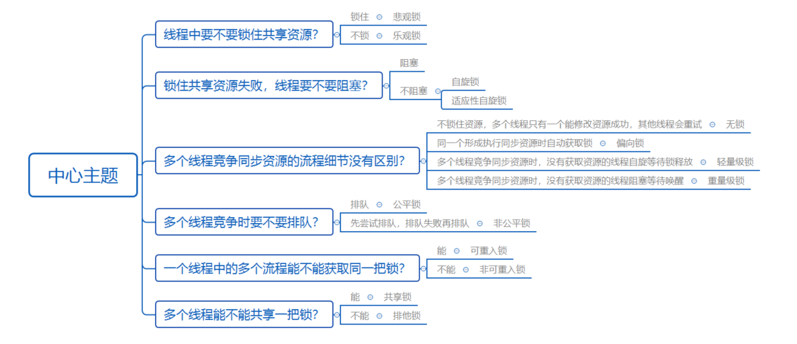
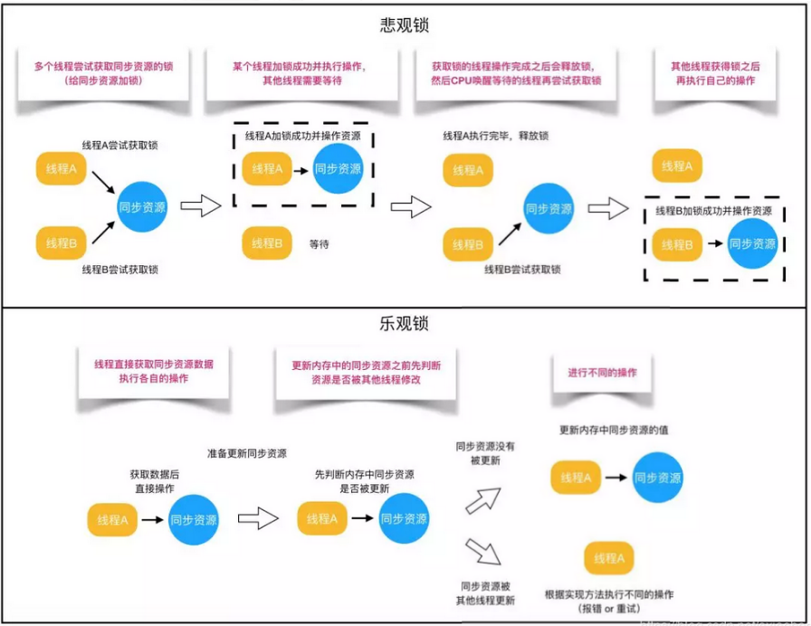

# Java锁

Java中提供了种类丰富的锁，各种锁又因为特性不同使用的场景也不同。

##  Java中主流的锁



## 乐观锁和悲观锁

乐观锁和悲观锁时一个广义上的概念，再数据库中和Java中都有不同的实现。

- 悲观锁认为自己修改的数据总会有人也回来修改，所有每次操作数据时，就会加上锁，确保自己能修改数据成功。Java中synchronized和lock都是悲观锁的实现。
- 乐观锁则是认为自己再修改数据时不会有人来修改输就，所以不会枷锁，只有再更新时才会去判断其他线程是否修改过。如果没有则将自己的数据写入，否则就会放弃这次更新，如果数据已经被其他线程更新，则根据不同的实现方式执行不同的操作（例如报错或者自动重试）。
- 乐观锁再Java中通过使用无锁编程实现，最常使用的时CAS算法，Java原子类中的自增操作就是通过CAS实现的，但是会出现ABA问题。



- 悲观锁适合于写操作多的场景，因为先加锁可以保证数据的正确性
- 乐观锁适合于查操作多的场景，因为不用加锁能够提高查操作的效率

### 悲观锁：

```java
//synchronized关键字
public synchronized void write(){
    //具体逻辑
}
//ReentrantLock
private ReentrantLock lock = new ReentrantLock();
public void write(){
	try{
        lock.lock();
        //具体逻辑
        ...
    }catch(Exception e){
        ...
    }finally{
        lock.unlock();
    }
}
```

### 悲观锁：

TODO：


