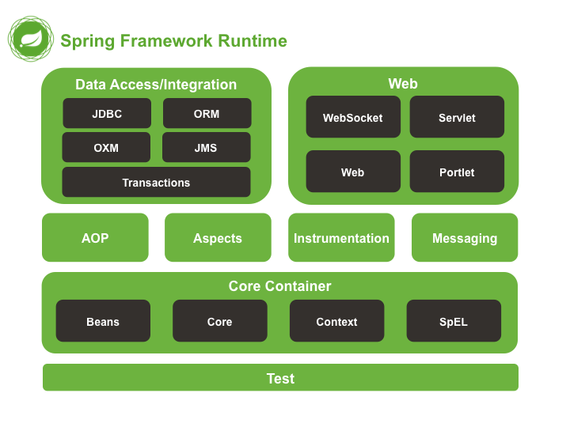

# 25个Spring经典问题

1. 什么是Spring框架？Spring框架有哪些主要模块？
> Spring框架是一个为Java应用程序的开发提供了综合、广泛的基础性支持的Java平台。Spring帮助开发者解决了开发中基础性的问题，使得开发人员可以专注于应用程序的开发。Spring框架本身亦是按照设计模式精心打造，这使得我们可以在开发环境中安心的集成Spring框架，不必担心Spring是如何在后台进行工作的。
Spring框架至今已集成了20多个模块。这些模块主要被分如下图所示的核心容器、数据访问/集成,、Web、AOP（面向切面编程）、工具、消息和测试模块。

2. 使用Spring框架有什么好处？
> •	Dependency Injection(DI) 方法使得构造器和JavaBean properties文件中的依赖关系一目了然。
•	与EJB容器相比较，IoC容器更加趋向于轻量级。这样一来IoC容器在有限的内存和CPU资源的情况下进行应用程序的开发和发布就变得十分有利。
•	Spring并没有闭门造车，Spring利用了已有的技术比如ORM框架、logging框架、J2EE、Quartz和JDK Timer，以及其他视图技术。
•	Spring框架是按照模块的形式来组织的。由包和类的编号就可以看出其所属的模块，开发者仅仅需要选用他们需要的模块即可。
•	要测试一项用Spring开发的应用程序十分简单，因为测试相关的环境代码都已经囊括在框架中了。更加简单的是，利用JavaBean形式的POJO类，可以很方便的利用依赖注入来写入测试数据。
•	Spring的Web框架亦是一个精心设计的Web MVC框架，为开发者们在web框架的选择上提供了一个除了主流框架比如Struts、过度设计的、不流行web框架的以外的有力选项。
•	Spring提供了一个便捷的事务管理接口，适用于小型的本地事物处理（比如在单DB的环境下）和复杂的共同事物处理（比如利用JTA的复杂DB环境）。

3. 什么是控制反转（IOC）？什么是依赖注入？
> 控制反转是应用于软件工程领域中的，在运行时被装配器对象来绑定耦合对象的一种编程技巧，对象之间耦合关系在编译时通常是未知的。在传统的编程方式中，业务逻辑的流程是由应用程序中的早已被设定好关联关系的对象来决定的。在使用控制反转的情况下，业务逻辑的流程是由对象关系图来决定的，该对象关系图由装配器负责实例化，这种实现方式还可以将对象之间的关联关系的定义抽象化。而绑定的过程是通过“依赖注入”实现的。
控制反转是一种以给予应用程序中目标组件更多控制为目的设计范式，并在我们的实际工作中起到了有效的作用。
依赖注入是在编译阶段尚未知所需的功能是来自哪个的类的情况下，将其他对象所依赖的功能对象实例化的模式。这就需要一种机制用来激活相应的组件以提供特定的功能，所以依赖注入是控制反转的基础。否则如果在组件不受框架控制的情况下，框架又怎么知道要创建哪个组件？
在Java中依然注入有以下三种实现方式：
> 1.	构造器注入
> 2.	Setter方法注入
> 3.	接口注入

4. 请解释下Spring中的IOC？
> Spring中的 org.springframework.beans 包和 org.springframework.context包构成了Spring框架IoC容器的基础。
BeanFactory 接口提供了一个先进的配置机制，使得任何类型的对象的配置成为可能。ApplicationContex接口对BeanFactory（是一个子接口）进行了扩展，在BeanFactory的基础上添加了其他功能，比如与Spring的AOP更容易集成，也提供了处理message resource的机制（用于国际化）、事件传播以及应用层的特别配置，比如针对Web应用的WebApplicationContext。
org.springframework.beans.factory.BeanFactory 是Spring IoC容器的具体实现，用来包装和管理前面提到的各种bean。BeanFactory接口是Spring IoC 容器的核心接口。

5. BeanFactory和ApplicationContext有什么区别？
> BeanFactory 可以理解为含有bean集合的工厂类。BeanFactory 包含了种bean的定义，以便在接收到客户端请求时将对应的bean实例化。
BeanFactory还能在实例化对象的时生成协作类之间的关系。此举将bean自身与bean客户端的配置中解放出来。BeanFactory还包含了bean生命周期的控制，调用客户端的初始化方法（initial
